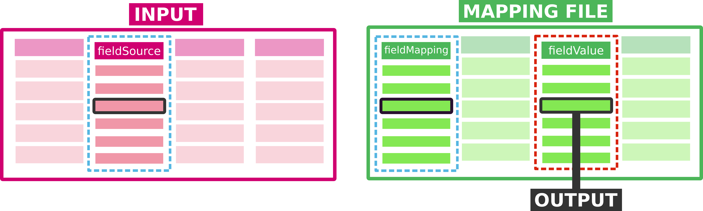

.. _Annotation structure:

.. role:: python(code)
  :language: python
  :class: highlight

Annotation structure
------------------------------

When we talk about the structure that **OpenVariant** needs, we can distinguish 3 different groups of files: `input`, `annotation`
and `output`.

.. image:: ../_static/workflow.gif
  :align: center

`Output` files are generated by **OpenVariant** and they will be the result of the whole process. On the other side,
the `input` and the `annotation` ones are provided by the user. `Input` files will be a bunch
of multiple files in different formats (e. g. ``tsv``, ``csv``, ``vcf``, ``maf``, ``bed``) which will be parsed in a
way that previously has been defined. The `annotation` will describe how the `output` will be and how `input` files will be parsed.

This `annotation` file will be a ``YAML`` file which will describe how `output` will look. On the follow section we can see the different
parameters that can handle `annotation` file in order to carry out the parsing process.

For further details and understand how to use, check our :ref:`Examples` and the `Annotation Example <https://github.com/bbglab/openvariant/blob/master/annotation_example.yaml>`_
and the `Annotation Template <https://github.com/bbglab/openvariant/blob/master/annotation_template.yaml>`_ on the GitHub repository.

Now we will take a look into the different parameters that are required to configure the `annotation` file and the optional ones:

Pattern (required)
^^^^^^^^^^^^^^^^^^^^

List of file patterns which the package will match and apply the corresponding annotation. Can be applied `regexp`
to search and match the files with that pattern.

.. code-block:: yaml

    # Example:
    pattern:
        - '*.maf'
        - '[a-zA-Z-]*.tsv'
        - 'samples.vcf.gz'

Format (optional)
^^^^^^^^^^^^^^^^^^^^

The format that the output will be, in case we save the output on a file or we would like to show on the standard output.
There are only two options: ``tsv`` (tab-separated value) or ``csv`` (comma-separated value). It is optional and the
default value is ``tsv``.

.. code-block:: yaml

    # Example:
    format: 'tsv'

Columns (optional)
^^^^^^^^^^^^^^^^^^^^

List of columns that we want as an output. All values must be values described in the `Annotation <#annotation>`_ parameter.
If it is empty the default value will be all the fields described in the `Annotation <#annotation>`_ parameter.

.. code-block:: yaml

    # Example:
    columns:
        - 'SAMPLE_ID'
        - 'NUM_CASES'
        - 'PROJECT'
        - 'COUNTRY'

Annotation (required)
^^^^^^^^^^^^^^^^^^^^^^^

A list of the different annotations that `output` file will have. The list of each field
will be set it up with the ``annotation`` key, then, each annotation will be described
on the list.

.. code-block:: yaml

    annotation:
        - ...
          ...
        - ...
          ...
        - ...
          ...

The order of the different annotations doesn't matter and in each annotation type has its different properties.
Each annotation type will be determined by ``type`` parameter and the name of the column that will create is a value
that we describe on ``field`` parameter. Each of them are explained in the following sections:

Static
#############

Fixed value that will be parsed to all the rows of the `output` file. The value can be a number or a string.

* ``type``: type of annotation. (required)
* ``field``: name that will appear as a head column of this annotation. (required)
* ``value``: final value that will parsed in all rows. (required)

.. code-block:: yaml

    # Example:
        - type: 'static'
          field: 'ID'
          value: 'SG2F24986083'

Also, we can combine other fields on a ``static`` annotation, as the following example represent:

.. code-block:: yaml

    # Example:
    # Where YEAR, DATASET and PATIENT are fields from other annotations
        - type: 'static'
          field: 'ID'
          value: '{YEAR}_{DATASET}_{PATIENT}'

Internal
#############

Transformation of `input` values to the `output`. It will match the ``fieldSource`` that appears in the `input` file and
it will rewrite with the new field name in the `output`. Also, all the value will be executed through ``function`` parameter
which is a lambda function that will take the value as an input.

* ``type``: type of annotation. (required)
* ``field``: name that will appear as a head column of this annotation. (required)
* ``value``: text to represent multiple ``fieldSource`` parameters. (optional)
* ``fieldSource``: list of that will try to match with input fields and transform it to the annotation ``field`` on the output. (required)
* ``function``: lambda function that will be executed after get the value of ``fieldSource``. If it is not specified it will execute :python:`(lambda y: y)` making any modification into the value. (optional)

.. code-block:: yaml

    # Example:
        - type: 'internal'
          field: 'CHROMOSOME'
          fieldSource:
            - 'Chromosome'
            - 'Chr'
            - 'Chrom'
            - 'Chromosome_Name'
            - '#chrom'
          function: "lambda c: c.upper().replace('CHR', '').replace('23', 'X').replace('24', 'Y')"

On the following example we can see the use of multiple fields on the ``internal`` type. It will format the ``value`` text
with the fields that appears on the ``fieldSource`` parameter. All the fields will must match with the ``value`` text.

.. code-block:: yaml

    # Example:
    # 'Symbol', 'Country' and 'Year' are columns from the input file.
        - type: 'internal'
          field: 'ID'
          value: 'Identity_{Symbol}_{Country}_{Year}'
          fieldSource:
            - ['Symbol', 'Country', 'Year']

Filename
#############

It will get the name of the `input` file that is processing at that moment
as the value of the ``field``. Also, the filename will be executed through ``function`` parameter and ``regex`` parameter as an input.

* ``type``: type of annotation. (required)
* ``field``: name that will appear as a head column of this annotation. (required)
* ``function``: lambda function that will be executed after get the value of ``fieldSource``. If it is not specified, it will execute :python:`(lambda y: y)` making any modification into the value. (optional)
* ``regex``: regular expression that will be executed after ``function`` parameter runs. If it is not specified, it will execute :python:`(.*)` as a regular expression. (optional)

.. code-block:: yaml

    # Example:
        - type: 'filename'
          field: 'DATASET'
          function: 'lambda x: "{}".format(x.lower()[:-4])'
          regex: '[a-zA-Z0-9]*.'

Dirname
#############

Based on the dirname where is located the `input` file. It will get the name of the directory which is located the `input` file
that is processing on that moment as ``field`` value. Also, the dirname will be executed through ``function`` parameter and ``regex`` parameter as an input.
It will result with the same workflow that `Filename <#filename>`_ type.

* ``type``: type of annotation. (required)
* ``field``: name that will appear as a head column of this annotation. (required)
* ``function``: lambda function that will be executed after get the value of ``fieldSource``. If it is not specified, it will execute :python:`(lambda y: y)` making any modification into the value. (optional)
* ``regex``: regular expression that will be executed after ``function`` parameter runs. If it is not specified, it will execute :python:`(.*)` as a regular expression. (optional)

.. code-block:: yaml

    # Example:
        - type: 'dirname'
          field: 'PROJECT'
          function: 'lambda x: "{}".format(x.lower())'
          regex: '[a-zA-Z0-9]*-[0-9]*'

Mapping
#############

Allows to use a `mapping` file to apply a new value based on a many-to-one relation between `input` file and the
`mapping` file. This annotation has different parameter that we can describe as:

* ``type``: type of annotation. (required)
* ``field``: name that will appear as a head column of this annotation. (required)
* ``fieldSource``: list of field that it will match from the `input` file. (required)
* ``fieldMapping``: field that it will match on the `mapping` file with the ``fieldSource`` parameter. (required)
* ``fileMapping``: the `mapping` file that it will use to parse this value. (required)
* ``fieldValue``: field that it will match on the `mapping` file and it will return as a value of this annotation. (required)

It will take ``fieldSource`` on the `input` file and it will match with the value of ``fieldMapping`` on the `mapping` file.
When these two values match it will get the value of `fieldValue` on that row as the value of the output ``field``.

.. code-block:: yaml

    # Example:
        - type: 'mapping'
          field: 'MUTATION_REF'
          fieldSource:
            - 'MutationID'
            - 'id'
            - 'Mutation_Id'
          fieldMapping: 'MUTATION_ID'
          fileMapping: 'metadata_mutation.tsv'
          fieldValue: 'REFERENCE'

Plugin
#############

It will apply the plugin functionality to each row of the `input` file. The plugin can be internal, located into `plugin`
folder or can be customized and created by the user. See further details in :ref:`Plugin system` section.

The parameters that `Plugin` needs are:

* ``type``: type of annotation. (required)
* ``field``: name that will appear as a head column of this annotation. (required)
* ``plugin``: name of plugin to apply (required)

.. code-block:: yaml

    # Example:
        - type: 'plugin'
          field: 'ALT_TYPE'
          plugin: 'alteration_type'

Exclude (optional)
^^^^^^^^^^^^^^^^^^^^^^^

List of values that will be excluded from the `output` file in the parsing process. This parameter is optional and all the elements
will be treated as an `OR` operation, it means if any of the elements turns true the row will be removed.

.. code-block:: yaml

    exclude:
        - ...
          ...
        - ...
          ...
        - ...
          ...

Each element is composed of a ``field`` parameter and a ``value`` parameter. If the ``value`` matches with the same ``field``
that appears in the `output`, the row that is reading on that moment will be excluded. Both parameters are required.
Here, a short example:

.. code-block:: yaml

    # Example:
        exclude:
          - field: 'DATASET'
            value: 'laml'

          - field: 'DATASET'
            value: 'ucs'

In addition, we can distinct ``!`` operator which it will exclude all the rows that are not the same as the ``value``
in the same ``field``. Short example of it:

.. code-block:: yaml

    # Example:
        exclude:
          - field: 'ID'
            value: '!GB00BLF7NX68'
