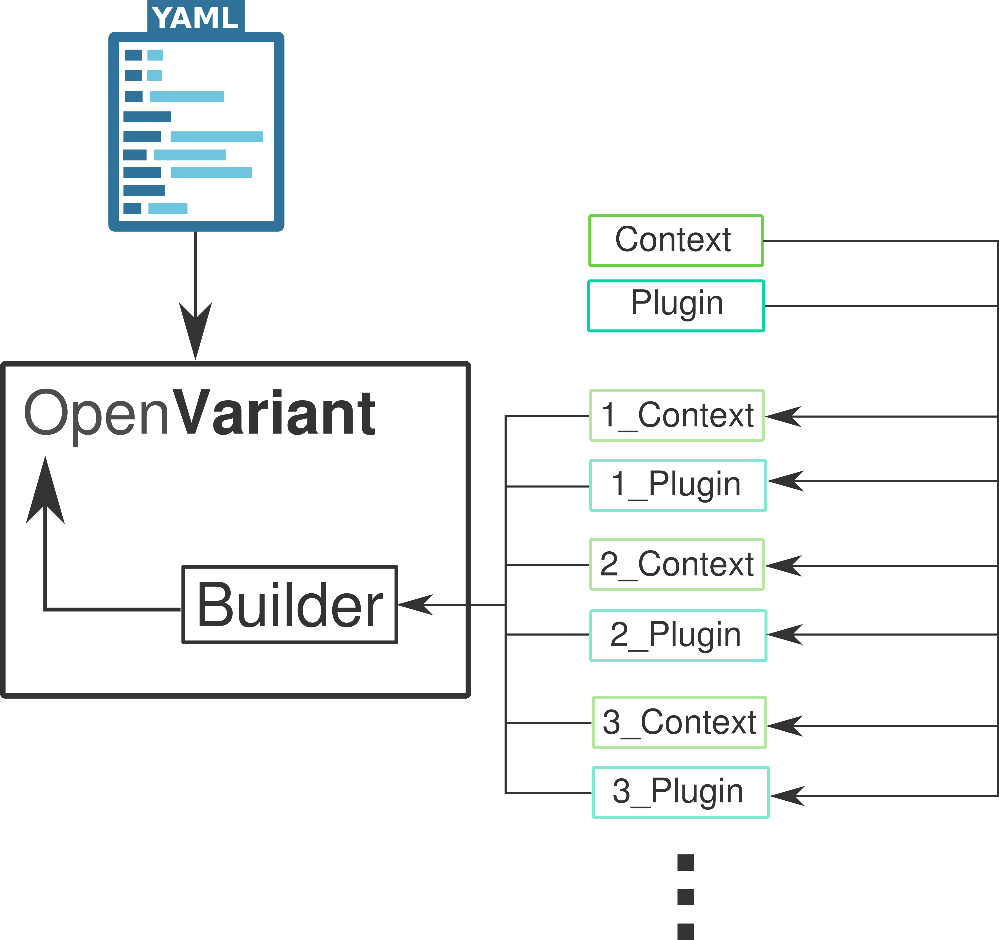

.. _Plugin system:

Plugin system
===============================

We designed a plugin system where the user will be able to create and add any kind of data transformation.
Each plugin has to be noticed on the `annotation` file as :ref:`Annotation structure` section explains, if it
wants to be used. An **OpenVariant**'s plugin is a python module composed of a single file. This file has two classes:

* **Context**: contains different attributes of the row and the file that is parsed (``row``, ``field_name``, ``file_path``). It is used as input argument that runs the plugin's functionality.
* **Plugin**: has ``run`` function that will process the row and apply the data transformation.

Each object will be working as a single base class to be inherited on each plugin. On the following schema we can
visualize how the different classes are connected and composed with **OpenVariant** package.

|

As we have mentioned before, the plugin has to be present on the `annotation` file in order to be used. Custom plugins will be placed in the 
folder where the environment variable :bash:`OPENVAR_PLUGIN` points (:bash:`/home/user/.local/share/openvariant/` by default). 
The `Builder` will manage to find them and apply the data transformation.
Plugins will inherit `Context` and `Plugin` as base classes for each plugin. These classes are described as it follows:

**Context**

.. code-block:: python

   class Context(object):
    """Base class that each context must inherit from"""

    def __init__(self, row: dict, field_name: str, file_path: str) -> None:
        self._row = row
        self._field_name = field_name
        self._file_path = file_path

    @property
    def row(self) -> dict:
        return self._row

    @property
    def field_name(self) -> str:
        return self._field_name

    @property
    def file_path(self) -> str:
        return self._file_path

**Plugin**

.. code-block:: python

   class Plugin(object):
    """Base class that each plugin must inherit from"""

    def run(self, argument):
        """
        This is a main function (required) which OpenVariant will call every time that this plugin is
        described in an annotation file.
        """
        raise NotImplementedError

Check :ref:`Command-line interface` to know how to create a new plugin. Also, to check more examples on how plugins can be
applied and written, see :ref:`Plugin examples`.